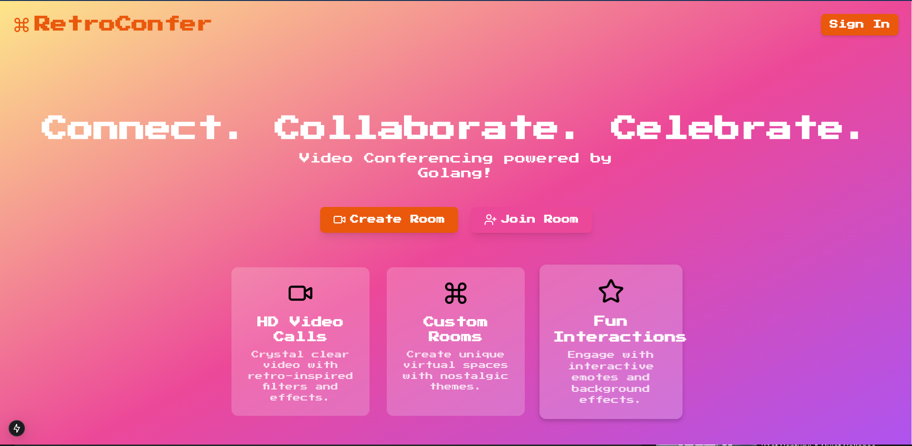

# RetroConfer 🎥✨

## Easy to use Video Conferencing app
A simple video conferencing app built on Golang powered by WebRTC and real-time communication. Simply sign in, create rooms and share room id with other.



## Tech 
- **Frontend**: Next.js, React, TailwindCSS
- **Backend**: Two mplementations of the Server in Golang (Gin and MUX )
- **Real-time Communication**: 
  - WebSockets for signaling
  - WebRTC for peer-to-peer video/audio streaming

## Key Features
- Peer-to-peer video calls
- Dynamic room creation
- Audio/video toggle controls
- WebRTC-based direct media streaming

## How It Works
1. **Signaling**: Gin WebSocket server handles peer connection negotiations
2. **Peer Connection**: 
   - Exchanges session descriptions
   - Manages ICE candidates
   - Establishes direct peer connections
3. **Media Streaming**: WebRTC enables direct browser-to-browser media transmission

## Highlights
- Real-time communication without central media routing
- Low-latency video/audio streaming
- Secure, encrypted peer connections
- Adaptive to different network conditions

## Running the Project
```bash
# Start Golang backend
go run server.go

# Start Next.js frontend
npm run dev
```

🚀 Enjoy seamless, retro-styled video conferencing!